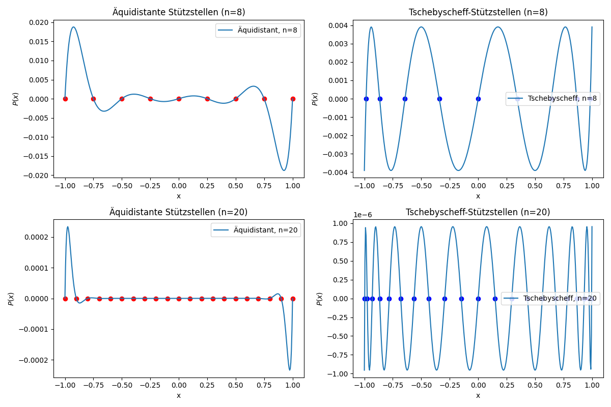
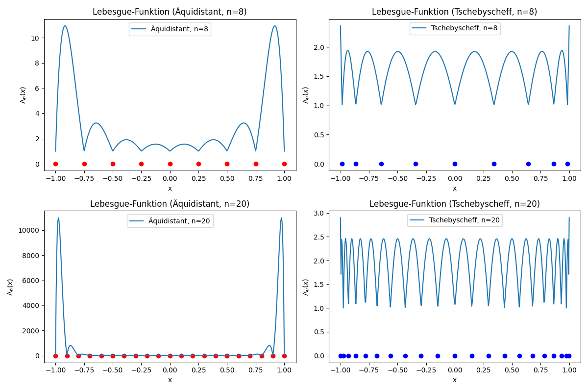

# 4.2 Polynominterpolation: Algorithmen I

Gegeben seien folgende vier Stutzpunkte $(x_i, f(x_i))$:
| i | 0 | 1 | 2 | 3 |
| - | - | - | - | - |
| $x_i$ | -1 | 0 | 2 | 3 |
| $f(x_i)$  | 8 | -2 | 2 | 4 |

### a) Berechnen Sie das zugehörige Interpolationspolynom mit dem Verfahren von Aitken-Neville (Skript: Algorithmus 4.12) und erstellen Sie Diagramme von allen vorkommenden $P_i$ $_,$ $_k$ . (Aussagekräftiger werden die Bilder, wenn sie nicht nur die Kurven, sondern auch die Stützpunkte enthalten...)

Interpolationspolynom mit dem Verfahren von Aitken-Neville:
$P(x) =-x^3 + 5x^2 - 4x - 2$

### b) Berechnen Sie das Interpolationspolynom nochmal mit den Newtonschen dividierten Differenzen. Berechnen Sie die dividierten Differenzen (Skript: Algorithmus 4.17 (unter Berücksichtigung der dem Algorithmus vorgestellten Notiz)) und dann für 0 ≤ k ≤ 3 die interpolierenden Polynome $P_k$ zu $x_0$, ..., $x_k$ und für 1 ≤ k ≤ 3 deren Differenz ∆$P_k$ := $P_k −$ $P_k$ $_−$ $_1$ (Skript: Gleichungen (4.39) und (4.40)). Erstellen Sie drei Diagramme, die für 1 ≤ k ≤ 3 jeweils $P_k −$ $P_k$ $_−$ $_1$ und ∆$P_k$ zeigen. (Diese Bilder werden aussagekräftiger, wenn man zu den Kurven sowohl die Stützpunkte als auch die Nullstellen der ∆$P_k$ markiert...)

TODO

# 4.3 Polynominterpolation: Algorithmen II

Mit dem Aitken-Neville-Schema soll ein Interpolationsproblem in den Stützstellen x0 = −2, x1 =
−1, x2 = 0, x3 = 1 bestimmt werden.

### a) Zunächst sei nur $P_2$ $_,$ $_2$ $(x) = x^2 + x + 1$ bekannt. Berechnen Sie alle Pi,k dieses Schemas, die durch $P_2$ $_,$ $_2$ festgelegt sind

TODO

# 4.5 Stützstellenwahl

### a)

### b)

